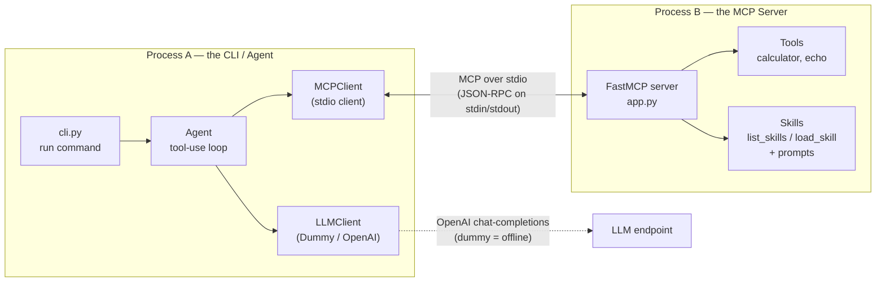
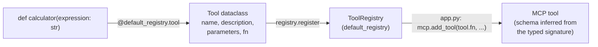
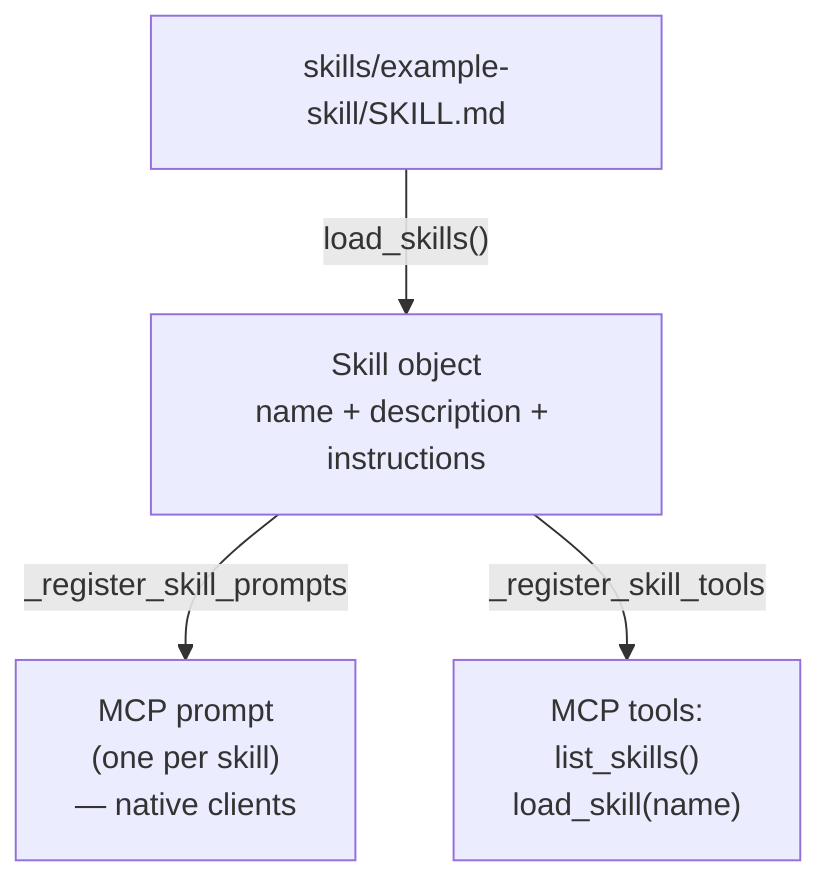
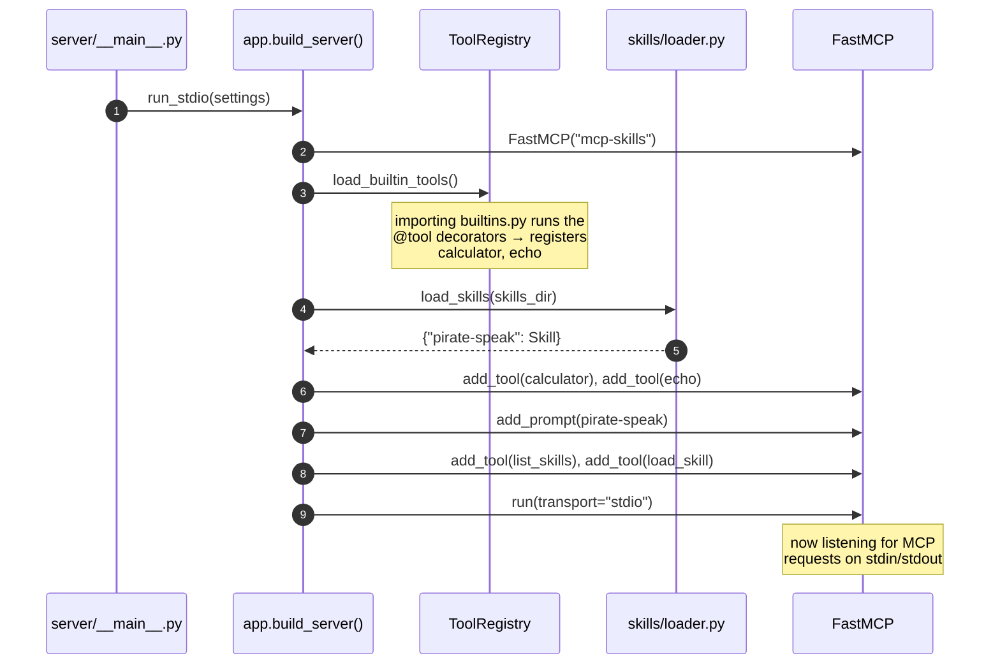
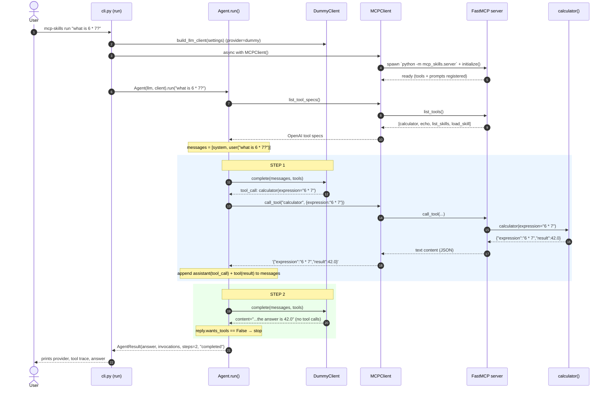
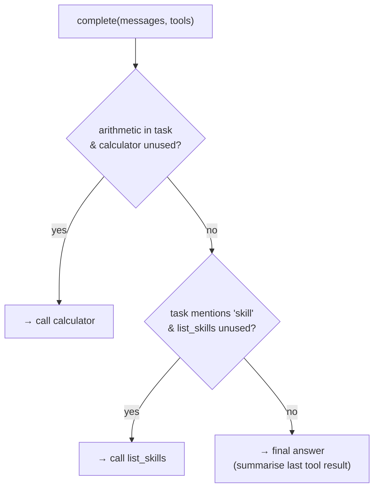
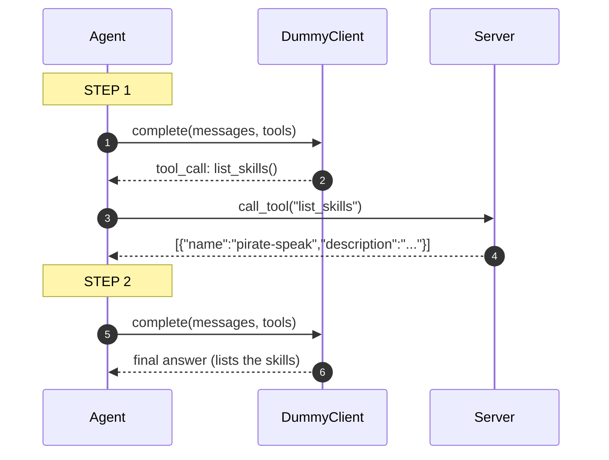

# How it works — an end-to-end walkthrough

> [!NOTE]
> **Obsidian Navigation:** [[README|Home (README)]] | [[LAYMAN_GUIDE|Layman's Guide]] | [[skills/pirate-speak/SKILL|Example Skill (SKILL.md)]]

This document traces a **single command** through the entire framework:

```bash
mcp-skills run "what is 6 * 7?"
```

By the end you'll understand exactly how the MCP server starts, how tools and
skills are created, registered, and exposed, how the agent discovers them, and how
the loop turns the user's prompt into a final answer.

> All diagrams are [Mermaid](https://mermaid.js.org/) and render directly on
> GitHub. File paths and names below match the real code in `src/mcp_skills/`.

---

## 0. The mental model

There are **two processes** and **one protocol** between them:



**Key idea — decoupling via MCP.** The agent never imports tool or skill code. It
only speaks MCP to the server. That means:

- Tools/skills are independently testable and swappable.
- The *same* server works with any MCP client (Claude Code, IDEs, the MCP
  Inspector), not just this agent.
- The LLM is behind the `LLMClient` interface, so the offline `DummyClient` and a
  real `OpenAIClient` are interchangeable by config.

---

## 1. How tools are created and exposed

A **tool** is a named, described, JSON-schema-typed callable. It knows nothing
about MCP — that adaptation happens later in `app.py`.

### 1a. Declaring a tool — `src/mcp_skills/server/tools/builtins.py`

```python
@default_registry.tool(
    name="calculator",
    description="Evaluate a basic arithmetic expression (+, -, *, /, %, **) ...",
    parameters={
        "type": "object",
        "properties": {"expression": {"type": "string", "description": "..."}},
        "required": ["expression"],
    },
)
def calculator(expression: str) -> dict[str, Any]:
    tree = ast.parse(expression, mode="eval")
    return {"expression": expression, "result": _safe_eval(tree)}
```

The `@default_registry.tool(...)` decorator (in `tools/registry.py`) wraps the
function in a `Tool` dataclass (`tools/base.py`) and stores it in the module-level
`default_registry`.

### 1b. From function to MCP tool



`_register_tools()` in `app.py` iterates the registry and calls
`mcp.add_tool(tool.fn, name=..., description=...)`. FastMCP inspects the typed
signature (`expression: str`) to produce the JSON input schema that clients see.

**To add your own tool:** drop another decorated function in `builtins.py`. No
other wiring required.

---

## 2. How skills are created and exposed

A **skill** is *data, not code*: a folder containing a `SKILL.md` (YAML
frontmatter + an instruction body) and optional `scripts/`. This mirrors
Anthropic's Agent Skills format.

```
skills/
└── example-skill/
    ├── SKILL.md          # ← name, description, instructions
    └── scripts/
        └── wordcount.py  # ← optional helper the instructions can reference
```

`SKILL.md`:

```markdown
---
name: pirate-speak
description: Rewrite text in the voice of a friendly pirate, keeping the meaning intact.
---
# Pirate Speak
...full instructions the agent reads when the skill is loaded...
```

### 2a. Discovery — `src/mcp_skills/server/skills/loader.py`

At server startup `load_skills(skills_dir)` scans every sub-folder, parses each
`SKILL.md` into a `Skill` (`skills/models.py`), and returns a `name -> Skill` map.
Malformed skills are logged and skipped, not fatal.

### 2b. Two MCP surfaces for skills

Skills are exposed over MCP in **two complementary ways** (both in `app.py`):



| Surface | What it is | Who uses it |
|---|---|---|
| **MCP prompt** (one per skill) | Returns the skill's instruction body | Any MCP client (Claude Code, IDEs) |
| **`list_skills` tool** | Lightweight catalog: `[{name, description}]` | The agent, for **progressive disclosure** |
| **`load_skill` tool** | Full instructions for one skill, on demand | The agent, once a skill is relevant |

**Progressive disclosure** is the important pattern: the agent first sees only
cheap skill *metadata* (names + one-line descriptions) and pulls the full, token-heavy
instructions **only when it decides a skill is relevant** — exactly how Anthropic
Agent Skills work, delivered here over MCP.

**To add your own skill:** create `skills/<name>/SKILL.md`. It's discovered at the
next server start — no code change, no redeploy.

---

## 3. Server startup

When the agent runs, it spawns the server as a subprocess
(`python -m mcp_skills.server`). Here is what that subprocess does:



After startup the server advertises **4 tools** — `calculator`, `echo`,
`list_skills`, `load_skill` — and **1 prompt** — `pirate-speak`.

---

## 4. The full request lifecycle

Now the headline flow. User runs:

```bash
mcp-skills run "what is 6 * 7?"
```

### 4a. Sequence diagram (the whole journey)



### 4b. The loop, in words

The engine is `Agent.run()` in [[src/mcp_skills/agent/agent.py|src/mcp_skills/agent/agent.py]]:

1. **Discover tools.** `client.list_tool_specs()` asks the server for its tools and
   converts each to an OpenAI `tools` spec (so any OpenAI-compatible model can use
   them).
2. **Seed the conversation.** `messages = [system prompt, user task]`. The system
   prompt ([[src/mcp_skills/agent/prompts.py|agent/prompts.py]]) tells the model to use tools and to use
   `list_skills` / `load_skill` for skills.
3. **Loop** (capped by `max_steps`, default 12):
   - Call the LLM: `reply = llm.complete(messages, tools)` (run in a thread so
     blocking network IO doesn't stall the event loop).
   - **If the reply has tool calls:** run each via `client.call_tool(...)`, record
     the invocation, append the assistant message *and* a `tool` result message,
     then continue the loop.
   - **If the reply is plain text:** that's the final answer → return.
4. **Return** an `AgentResult(answer, invocations, steps, stop_reason)`.

### 4c. How `messages` grows during our example

| Step | Role | Content |
|------|------|---------|
| seed | `system` | "You are a helpful agent with access to tools…" |
| seed | `user` | `"what is 6 * 7?"` |
| 1 | `assistant` | *(tool_call)* `calculator(expression="6 * 7")` |
| 1 | `tool` | `{"expression":"6 * 7","result":42.0}` |
| 2 | `assistant` | `"…the answer is 42.0"` ← no tool calls → **done** |

This message list is the standard OpenAI chat-completions shape (see
[[src/mcp_skills/llm/base.py|llm/base.py]]), so swapping the dummy for a real model changes nothing about the
loop.

---

## 5. Where the "thinking" comes from (and how to make it real)

In this demo the `DummyClient` ([[src/mcp_skills/llm/dummy.py|llm/dummy.py]]) is a **deterministic, offline
stand-in** — not a real model. It uses two tiny rules so the loop is exercised
without an API key:



It also supports a **scripted mode** (a pre-set queue of replies) used by the tests
for full determinism.

**To use a real model — no code change, just config** (`.env`):

```bash
MCP_SKILLS_LLM_PROVIDER=openai
MCP_SKILLS_MODEL=gpt-4o-mini
MCP_SKILLS_OPENAI_BASE_URL=https://api.openai.com/v1   # or ANY OpenAI-compatible endpoint
MCP_SKILLS_OPENAI_API_KEY=sk-...
```

`build_llm_client()` ([[src/mcp_skills/llm/__init__.py|llm/__init__.py]]) then returns an `OpenAIClient`
([[src/mcp_skills/llm/openai_client.py|llm/openai_client.py]]) instead of the dummy. The agent loop, the MCP client, the
tools, and the skills are all untouched — that's the payoff of putting the LLM
behind the `LLMClient` protocol.

---

## 6. A second example — using a skill

Try a skill-oriented prompt:

```bash
mcp-skills run "what skills are available?"
```



With a **real** model the next step would typically be a `load_skill("pirate-speak")`
call to pull the full instructions, then the model would apply them — the
progressive-disclosure pattern from §2b in action.

---

## 7. Map of the code

| You want to understand… | Read this file |
|---|---|
| The CLI entry points (`serve`, `run`, `skills list`) | [[src/mcp_skills/cli.py|src/mcp_skills/cli.py]] |
| The agent tool-use loop | [[src/mcp_skills/agent/agent.py|src/mcp_skills/agent/agent.py]] |
| The stdio MCP client | [[src/mcp_skills/agent/mcp_client.py|src/mcp_skills/agent/mcp_client.py]] |
| Server wiring (tools + skills → MCP) | [[src/mcp_skills/server/app.py|src/mcp_skills/server/app.py]] |
| Tool definitions & registry | [[src/mcp_skills/server/tools/builtins.py|src/mcp_skills/server/tools/]] |
| Skill model & SKILL.md loader | [[src/mcp_skills/server/skills/loader.py|src/mcp_skills/server/skills/]] |
| LLM interface + dummy + OpenAI | [[src/mcp_skills/llm/base.py|src/mcp_skills/llm/]] |
| Configuration (env-driven) | [[src/mcp_skills/config.py|src/mcp_skills/config.py]] |

---

## 8. Try it yourself

```bash
uv pip install -e ".[dev]"

mcp-skills skills list                 # see discovered skills
mcp-skills run "what is 6 * 7?"        # arithmetic → calculator tool
mcp-skills run "what skills exist?"    # → list_skills tool
mcp-skills serve                       # raw MCP server on stdio

# Inspect the server interactively (tools, prompts, skills):
npx @modelcontextprotocol/inspector mcp-skills serve

pytest -q                              # 17 tests, fully offline
```
