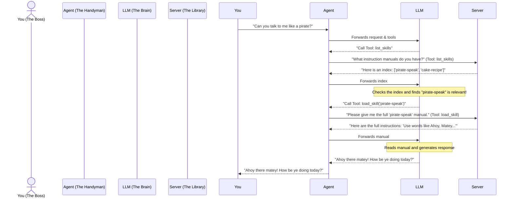
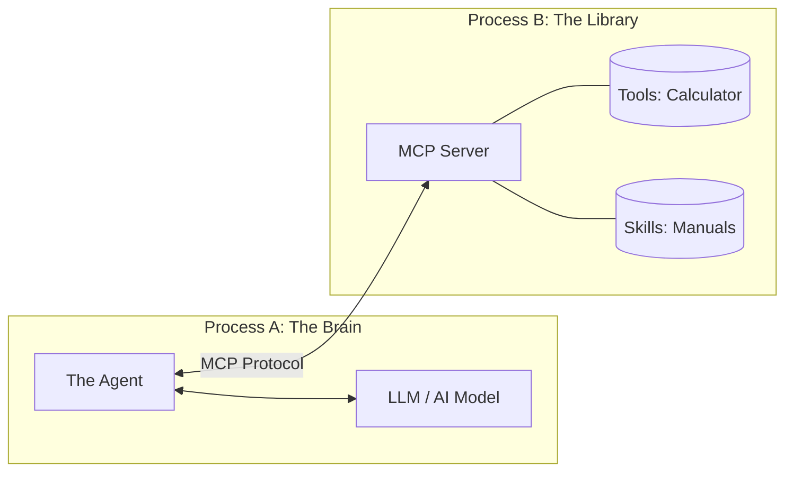

# A Layman's Guide to MCP Skills

> [!NOTE]
> **Obsidian Navigation:** [[README|Home (README)]] | [[FLOW|Technical Walkthrough (FLOW)]] | [[skills/pirate-speak/SKILL|Example Skill (SKILL.md)]]

## The "Too Much Information" Problem
Imagine you hire a very smart, capable assistant to help you with various tasks. You want them to be able to do everything: write emails, fix plumbing, bake cakes, and speak like a pirate.

If you give this assistant the **entire instruction manual** for every single task before they even start working, their brain will be overwhelmed. In the world of AI (Large Language Models), giving the AI all these instructions upfront consumes a lot of **tokens** (memory limit) and makes the AI slower, more expensive, and easily confused.

## The Solution: Progressive Disclosure
This project solves that problem using something called **Progressive Disclosure** over the **Model Context Protocol (MCP)**. 

Instead of giving the AI all the instruction manuals upfront, we give it:
1. **Basic Tools:** Simple tools it knows how to use immediately (like a calculator).
2. **An Index of Skills:** A simple list of titles and short descriptions of manuals it *could* read (e.g., [[skills/pirate-speak/SKILL|Pirate Speak: How to talk like a pirate]]).

When you ask the AI to do something, it checks its index. If it needs a specific manual, it asks for it *on the spot*.

## Real-World Analogy: The Handyman

Let's look at how this works in practice. 

In this analogy:
- **The Agent** is the AI (powered by an LLM).
- **The Server** is the library holding all the heavy instruction manuals.
- **The Protocol (MCP)** is the universal language they use to talk to each other.

## How the Architecture Works

This project physically separates the "Brain" (the Agent) from the "Knowledge Base" (the Server) into two different processes. They communicate using the **Model Context Protocol (MCP)**, which is like a standardized API for AI.

### Why is this separation good?
1. **Cost and Speed Efficiency:** By only loading skills when needed, the AI prompt stays small and focused, saving money on API costs and getting faster responses.
2. **Swappable Brains:** Because the Agent and the Server are decoupled, you can swap out the AI (e.g., switch from OpenAI to a local offline model) without changing the tools or skills.
3. **Universal Library:** The Server just hosts the tools and skills via MCP. This means *any* AI that understands MCP (like Claude Code or a supported IDE) can connect to this server and use its skills.

## What is a "Skill" vs a "Tool"?

- **Tool:** A specific, programmable action the AI can take. Example: A `calculator` tool that literally runs Python math code and returns the answer.
- **Skill:** A set of natural language instructions (a markdown document) that teaches the AI *how* to act or think for a specific task. Example: [[skills/pirate-speak/SKILL|pirate-speak]], which contains rules on vocabulary and tone. 

The clever part of this project is that it uses a **Tool** (`load_skill`) to retrieve a **Skill**!

## Summary
In short, this project is a framework that allows an AI agent to dynamically request and learn new skills on the fly from a separate server. This keeps the AI fast, focused, and unburdened by unnecessary information until exactly when it's needed.
