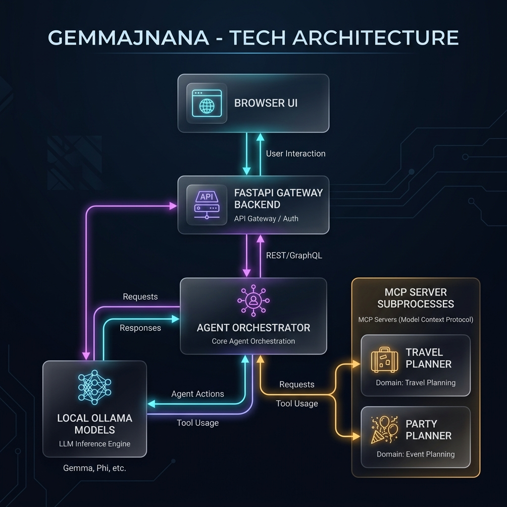
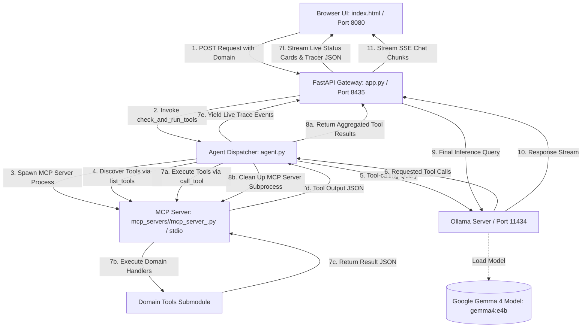
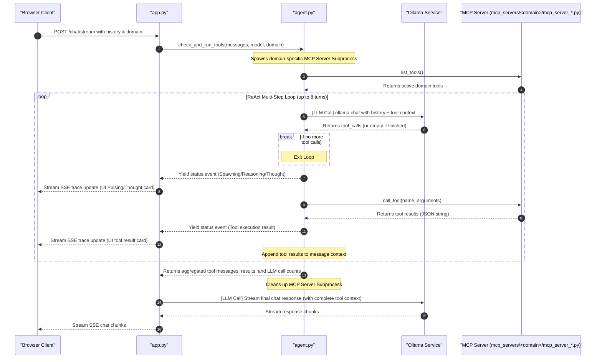

# GemmaJnana


A local development stack to download, serve, and interact with Google's **Gemma 4 (Effective 4B)** model using **Ollama** and an asynchronous **FastAPI** gateway. The package includes a multi-domain Model Context Protocol (MCP) server structure and a beautiful, fully animated chat playground UI.

---

## Project Architecture Flow

Below is the visual flow of the GemmaJnana local multi-domain architecture.



### Data Flow Diagram



### Dynamic Agentic Pipeline Flow



---

## Domain Architecture Overview

GemmaJnana is structured as a multi-domain agentic framework supporting two fully featured planning assistant types. You can toggle between domains dynamically via the UI settings bar:

### 1. Vacation Travel Planner (`mcp_servers/travel/`)
Equips the agent with 7 tools to search flight/hotel inventory, make bookings, rent vehicles, schedule tourist attractions, and compile final formatted itinerary documents:
*   `search_flights(origin, destination, date)`
*   `book_flight(flight_id)`
*   `search_hotels(city, budget)`
*   `book_hotel(hotel_name, nights)`
*   `rent_car(city, car_type)`
*   `book_attraction(city, activity)`
*   `generate_travel_itinerary(bookings)`

#### Predefined Travel Skills (JSON pipelines under `skills/`):
*   **Full Vacation Planner Pipeline:** `search_flights` ➔ `book_flight` ➔ `search_hotels` ➔ `book_hotel` ➔ `generate_travel_itinerary`
*   **Quick Flight Booking Pipeline:** `search_flights` ➔ `book_flight` ➔ `generate_travel_itinerary`
*   **Accommodation & Ground Services Pipeline:** `search_hotels` ➔ `book_hotel` ➔ `rent_car` ➔ `book_attraction`

---

### 2. Birthday Party Planner (`mcp_servers/party/`)
Equips the AI assistant to manage invitations, budget estimations, venue scheduling, cake ordering, entertainment hiring, theme decorations, and reminders:
*   `invite_guests(guest_names)`
*   `budget_expenses(rsvp_count)`
*   `book_venue(venue_name, guest_count)`
*   `order_cake(flavor, size, inscription)`
*   `hire_entertainment(type)`
*   `buy_decorations(theme)`
*   `send_reminders(guest_emails, location)`

#### Predefined Party Skills (JSON pipelines under `skills/`):
*   **Core Event Planning Sequence:** `invite_guests` ➔ `budget_expenses` ➔ `book_venue` ➔ `order_cake` ➔ `send_reminders`
*   **Invitation & Budget Setup:** `invite_guests` ➔ `budget_expenses` ➔ `send_reminders`
*   **Logistics & Theme Purchasing:** `book_venue` ➔ `order_cake` ➔ `hire_entertainment` ➔ `buy_decorations`

---

## File Structure

```text
ollama-gemma-agents-mcp-skills/
├── mcp_servers/                 <-- Multi-domain MCP Servers
│   ├── travel/                  <-- Vacation Travel Planner Domain
│   │   ├── skills/              (JSON Skill pipelines)
│   │   ├── tools/               (Tool implementations & schemas)
│   │   └── mcp_server_travel.py (FastMCP Server process)
│   └── party/                   <-- Birthday Party Planner Domain
│       ├── skills/              (JSON Skill pipelines)
│       ├── tools/               (Tool implementations & schemas)
│       └── mcp_server_party.py  (FastMCP Server process)
├── tests/                       <-- Complete Unit Test Suite
│   ├── test_handlers.py         (Validates all 14 tool handlers)
│   ├── test_mcp.py              (Verifies tool registrations)
│   └── test_skills.py           (Validates JSON sequence formats)
├── agent.py                     (Asynchronous agent orchestrator & ReAct runner)
├── app.py                       (FastAPI Gateway & SSE event streams)
├── index.html                   (Beautiful dark-mode chat playground client)
├── logger.py                    (Global session logger)
├── start.sh                     (Automation installer & launcher)
└── stop.sh                      (Automation teardown script)
```

---

## Prerequisites

To run this application, make sure you have:
1.  **macOS** (the automated installer `start.sh` assumes Mac context).
2.  **Python 3.x** with dependencies listed in `requirements.txt`:
    ```bash
    pip install fastapi uvicorn ollama mcp fastmcp python-dotenv
    ```

---

## How to Run

1.  **Start the entire service stack**:
    ```bash
    ./start.sh
    ```
    This script automatically updates Ollama, pulls the `gemma4:e4b` model, installs required dependencies, runs the backend API Gateway (port `8435`), and spins up a local web server (port `8080`).

2.  **Open the Web Playground**:
    Navigate to [**`http://localhost:8080`**](http://localhost:8080) in your browser. Toggle between **Vacation Travel Planner** and **Birthday Party Planner** domains dynamically using the selector in the upper right.

3.  **Shut down servers gracefully**:
    Press `Ctrl+C` in your terminal, or to guarantee all background processes (FastAPI, Ollama) exit cleanly, run:
    ```bash
    ./stop.sh
    ```

---

## Running Unit Tests

We maintain a rigorous test suite validating the registry, schemas, and execution responses of all tool handlers:
```bash
python3 -m unittest discover -s tests
```

---

## API Reference

The backend FastAPI gateway runs at `http://127.0.0.1:8435`:
*   `GET /health`: Diagnoses model presence and connection status.
*   `GET /tools?domain=...`: Lists active tools dynamically registered by FastMCP for the specified domain.
*   `GET /skills?domain=...`: Retrieves predefined JSON skill pipelines for the specified domain.
*   `POST /chat`: Simple non-streaming message response endpoint.
*   `POST /chat/stream`: Initiates an SSE text stream event channel, sending live tracer cards for active tools.
