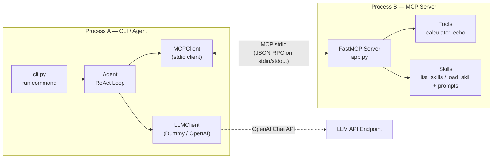

# MCP Skills

A lightweight, robust, and decoupled CLI/Agent framework demonstrating **progressive disclosure of Agent Skills** over the **Model Context Protocol (MCP)**. 

This project implements a complete local agentic loop that communicates with a backend MCP server using `stdio` transport. It enables the agent to discover tools and fetch complex instructions (skills) dynamically and on-demand only when relevant.

## 🗺️ Obsidian Vault Map
*Quickly navigate the documentation inside Obsidian:*
- 🏠 **Home (README)**: [[README]]
- 📖 **Layman's Guide**: [[LAYMAN_GUIDE|A Layman's Guide to MCP Skills]]
- ⚙️ **System Flow & Walkthrough**: [[FLOW|How it works — an end-to-end walkthrough]]
- 🏴‍☠️ **Example Skill**: [[skills/pirate-speak/SKILL|Pirate Speak Skill (SKILL.md)]]

---

## Key Features

- **Decoupled Architecture**: Process A (CLI/Agent) communicates with Process B (MCP Server) strictly via JSON-RPC over the Model Context Protocol. No importing of server tools or skill loader logic in the agent.
- **Progressive Skill Disclosure**: The agent first lists metadata (names and descriptions) of available skills cheaply and only pulls the token-heavy instructions when the LLM determines the skill is relevant.
- **AST-based Calculator**: A safe math evaluation tool restricting execution to basic numbers and arithmetic operations, fully protected against remote code execution.
- **Robust Local Testing**: Built-in rule-based and scripted `DummyClient` allowing deterministic, offline testing of multi-step agent behaviors without needing LLM API keys.
- **Real LLM Integration**: Seamless toggle to real OpenAI-compatible endpoints using environment configuration.
- **Modern Package Layout**: Structured clean package layout using a Click-based CLI and pyproject.toml setup.

---

## System Architecture



---

## Project Layout

```text
mcp-skills-new/
├── pyproject.toml              # Build backend and dependencies config
├── FLOW.md                     # Walkthrough explaining how the framework runs
├── README.md                   # This overview file
├── skills/                     # Builtin skills catalog
│   └── pirate-speak/
│       └── SKILL.md            # Pirate-speak instructions with frontmatter
├── src/
│   └── mcp_skills/
│       ├── __init__.py
│       ├── cli.py              # Click commands entry point
│       ├── config.py           # Configuration parser settings
│       ├── agent/              # CLI Agent components
│       │   ├── __init__.py
│       │   ├── agent.py        # ReAct orchestration loop
│       │   ├── mcp_client.py   # MCP stdio client wrapper
│       │   └── prompts.py      # System prompts
│       ├── llm/                # LLM connectors (Dummy & OpenAI)
│       │   ├── __init__.py
│       │   ├── base.py
│       │   ├── dummy.py
│       │   └── openai_client.py
│       └── server/             # Stdio/SSE MCP server
│           ├── __init__.py
│           ├── __main__.py
│           ├── app.py          # FastMCP server wiring
│           ├── skills/         # Skill markdown loader
│           │   ├── __init__.py
│           │   ├── loader.py
│           │   └── models.py
│           └── tools/          # Registry and builtin tools
│               ├── __init__.py
│               ├── base.py
│               ├── registry.py
│               └── builtins.py
└── tests/                      # 18 pytest unit/integration tests
```

> [!TIP]
> **Obsidian Navigation Tip:** You can open and edit key files directly inside Obsidian using these links:
> - [[FLOW]] — Detailed technical walkthrough of the ReAct agent loop and the stdio communication.
> - [[LAYMAN_GUIDE]] — High-level, developer-friendly overview with analogies.
> - [[skills/pirate-speak/SKILL]] — The example skill instruction template.

---

## Installation

Install the package and its development dependencies in editable mode:

```bash
python3 -m pip install -e ".[dev]"
```

---

## Usage

### 1. Run the Agent Loop
Trigger the agent to answer questions. It will spawn the stdio MCP server subprocess automatically, inspect active tools, reason through steps, call appropriate tools, and return a summary.

#### Math execution (uses AST calculator tool):
```bash
mcp-skills run "what is 6 * 7?"
```

#### Skills discovery & lazy loading:
```bash
mcp-skills run "what skills exist?"
```

### 2. Explore Discovered Skills via CLI
Explore loaded skill templates without starting the agent loop:
```bash
mcp-skills skills list
```

### 3. Run Standalone MCP Server
Start a raw MCP server listening on stdin/stdout:
```bash
mcp-skills serve
```

Inspect tools and prompts interactively via the [MCP Inspector](https://github.com/modelcontextprotocol/inspector):
```bash
npx @modelcontextprotocol/inspector mcp-skills serve
```

---

## Running with a Real LLM

To switch from the offline `DummyClient` to a real model, create a `.env` file in the project root:

```ini
MCP_SKILLS_LLM_PROVIDER=openai
MCP_SKILLS_MODEL=gpt-4o-mini
MCP_SKILLS_OPENAI_BASE_URL=https://api.openai.com/v1
MCP_SKILLS_OPENAI_API_KEY=your-api-key-here
```

---

## Running Tests

Execute the test suite to run 18 offline verification checks:

```bash
pytest -v
```
