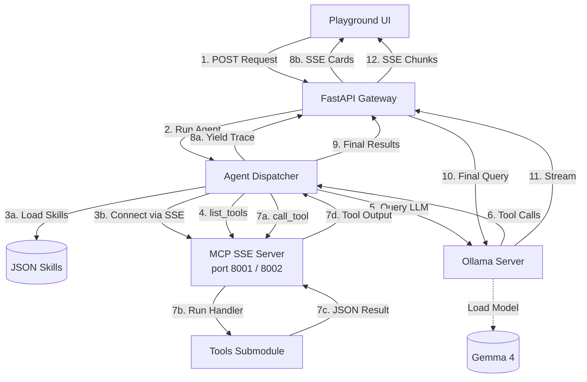
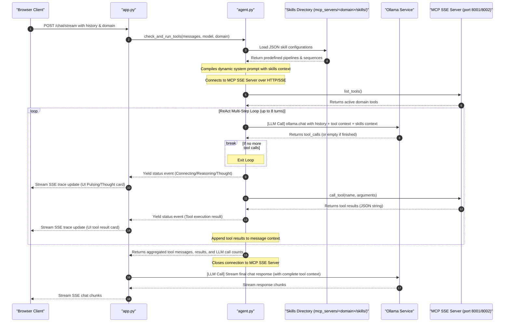
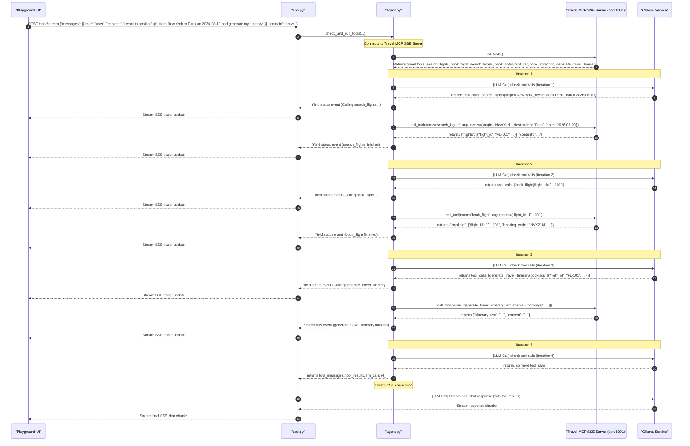
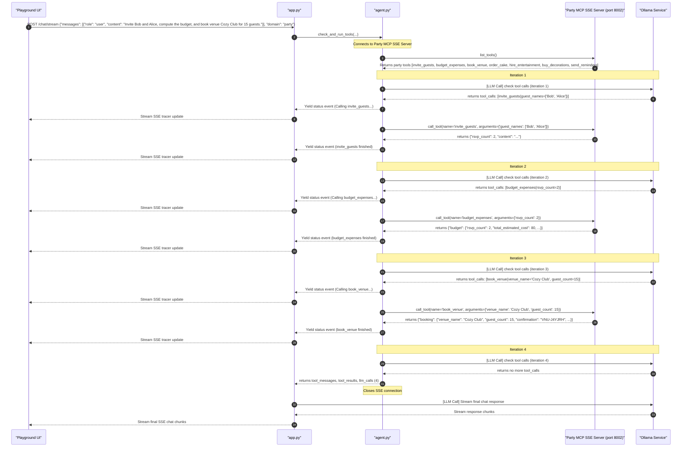

# GemmaJnana


A local development stack to download, serve, and interact with Google's **Gemma 4 (Effective 4B)** model using **Ollama** and an asynchronous **FastAPI** gateway. The package includes a multi-domain Model Context Protocol (MCP) server structure and a beautiful, fully animated chat playground UI.

---

## Project Architecture Flow

Below is the visual flow of the GemmaJnana local multi-domain architecture.


### Data Flow Diagram



### Dynamic Agentic Pipeline Flow



---

## Domain Architecture Overview

GemmaJnana is structured as a multi-domain agentic framework supporting two fully featured planning assistant types. You can toggle between domains dynamically via the UI settings bar:

### 1. Vacation Travel Planner (`mcp_servers/travel/`)
Equips the agent with 7 tools to search flight/hotel inventory, make bookings, rent vehicles, schedule tourist attractions, and compile final formatted itinerary documents:
*   `search_flights(origin, destination, date)`
*   `book_flight(flight_id)`
*   `search_hotels(city, budget)`
*   `book_hotel(hotel_name, nights)`
*   `rent_car(city, car_type)`
*   `book_attraction(city, activity)`
*   `generate_travel_itinerary(bookings)`

#### Predefined Travel Skills (JSON pipelines under `skills/`):
*   **Full Vacation Planner Pipeline:** `search_flights` ➔ `book_flight` ➔ `search_hotels` ➔ `book_hotel` ➔ `generate_travel_itinerary`
*   **Quick Flight Booking Pipeline:** `search_flights` ➔ `book_flight` ➔ `generate_travel_itinerary`
*   **Accommodation & Ground Services Pipeline:** `search_hotels` ➔ `book_hotel` ➔ `rent_car` ➔ `book_attraction`

---

### 2. Birthday Party Planner (`mcp_servers/party/`)
Equips the AI assistant to manage invitations, budget estimations, venue scheduling, cake ordering, entertainment hiring, theme decorations, and reminders:
*   `invite_guests(guest_names)`
*   `budget_expenses(rsvp_count)`
*   `book_venue(venue_name, guest_count)`
*   `order_cake(flavor, size, inscription)`
*   `hire_entertainment(type)`
*   `buy_decorations(theme)`
*   `send_reminders(guest_emails, location)`

#### Predefined Party Skills (JSON pipelines under `skills/`):
*   **Core Event Planning Sequence:** `invite_guests` ➔ `budget_expenses` ➔ `book_venue` ➔ `order_cake` ➔ `send_reminders`
*   **Invitation & Budget Setup:** `invite_guests` ➔ `budget_expenses` ➔ `send_reminders`
*   **Logistics & Theme Purchasing:** `book_venue` ➔ `order_cake` ➔ `hire_entertainment` ➔ `buy_decorations`

---

## Agent Capabilities & Limitations

Before running the application, it is important to understand what this local agentic stack is capable of and its current boundaries:

| What the Agent CAN Do | What the Agent CANNOT Do |
| :--- | :--- |
| **Enforced Skill Sequences:** Strictly follows sequence pipelines defined in JSON (e.g. searching, booking, and itinerary generation in order). | **Real-world Bookings:** All bookings are mocked locally for testing safety. It does not spend real money or call live airline/hotel APIs. |
| **Dynamic Data Passing:** Feeds output states from previous steps into subsequent calls (e.g., passing RSVP counts to budget calculation). | **Real-Time Inventory Access:** The toolset operates on simulated local catalogs; it does not query actual live commercial availability. |
| **Interactive Domain Switching:** Automatically updates LLM instruction templates, loaded tools, and active skills when domain toggling. | **Dynamic Mid-Sequence Input:** Once a sequence starts, the agent executes it autonomously; it cannot pause to prompt you for decisions mid-flow. |
| **Comprehensive Logging:** Formats execution tracer cards in the UI and records detailed step-by-step telemetry in local logs. | **Extremely Complex Logic:** Running a 4B parameter model locally is excellent for sequence orchestration, but it may occasionally deviate on highly complex reasoning. |

---

## File Structure

```text
ollama-gemma-agents-mcp-skills/
├── mcp_servers/                 <-- Multi-domain MCP Servers
│   ├── travel/                  <-- Vacation Travel Planner Domain
│   │   ├── skills/              (JSON Skill pipelines)
│   │   ├── tools/               (Tool implementations & schemas)
│   │   └── mcp_server_travel.py (FastMCP Server process)
│   └── party/                   <-- Birthday Party Planner Domain
│       ├── skills/              (JSON Skill pipelines)
│       ├── tools/               (Tool implementations & schemas)
│       └── mcp_server_party.py  (FastMCP Server process)
├── tests/                       <-- Complete Unit Test Suite
│   ├── test_handlers.py         (Validates all 14 tool handlers)
│   ├── test_mcp.py              (Verifies tool registrations)
│   └── test_skills.py           (Validates JSON sequence formats)
├── agent.py                     (Asynchronous agent orchestrator & ReAct runner)
├── app.py                       (FastAPI Gateway & SSE event streams)
├── index.html                   (Beautiful dark-mode chat playground client)
├── logger.py                    (Global session logger)
├── start.sh                     (Automation installer & launcher)
└── stop.sh                      (Automation teardown script)
```

---

## Prerequisites

To run this application, make sure you have:
1.  **macOS** (the automated installer `start.sh` assumes Mac context).
2.  **Python 3.x** with dependencies listed in `requirements.txt`:
    ```bash
    pip install fastapi uvicorn ollama mcp fastmcp python-dotenv
    ```

---

## How to Run

1.  **Start the entire service stack**:
    ```bash
    ./start.sh
    ```
    This script automatically updates Ollama, pulls the `gemma4:e4b` model, installs required dependencies, runs the backend API Gateway (port `8435`), and spins up a local web server (port `8080`).

2.  **Open the Web Playground**:
    Navigate to [**`http://localhost:8080`**](http://localhost:8080) in your browser. Toggle between **Vacation Travel Planner** and **Birthday Party Planner** domains dynamically using the selector in the upper right.

3.  **Shut down servers gracefully**:
    Press `Ctrl+C` in your terminal, or to guarantee all background processes (FastAPI, Ollama) exit cleanly, run:
    ```bash
    ./stop.sh
    ```

---

## Running Unit Tests

We maintain a rigorous test suite validating the registry, schemas, and execution responses of all tool handlers:
```bash
python3 -m unittest discover -s tests
```

---

## API Reference

The backend FastAPI gateway runs at `http://127.0.0.1:8435`:
*   `GET /health`: Diagnoses model presence and connection status.
*   `GET /tools?domain=...`: Lists active tools dynamically registered by FastMCP for the specified domain.
*   `GET /skills?domain=...`: Retrieves predefined JSON skill pipelines for the specified domain.
*   `POST /chat`: Simple non-streaming message response endpoint.
*   `POST /chat/stream`: Initiates an SSE text stream event channel, sending live tracer cards for active tools.

---

## Step-by-Step Code Execution Trace (Debugging Walkthrough)

To make it easy to follow the flow of control, here is a step-by-step trace showing exactly how inputs and outputs travel through the codebase for different scenarios.

---

### Scenario A: Vacation Flight Booking (Travel Domain)
**User Prompt:** `"I want to book a flight from New York to Paris on 2026-08-10 and generate my itinerary."`



#### **Step 1: Frontend Request**
The user selects the **Vacation Travel Planner** domain and enters the prompt. The browser client (`index.html`) issues an HTTP `POST` request to `/chat/stream` with the conversation history and active domain:
*   **Payload:**
    ```json
    {
      "messages": [
        {"role": "user", "content": "I want to book a flight from New York to Paris on 2026-08-10 and generate my itinerary."}
      ],
      "domain": "travel",
      "session_name": "default"
    }
    ```

#### **Step 2: Gateway Entry & Agent Call (`app.py` & `agent.py`)**
1. The gateway endpoint `chat_stream` in `app.py` receives the payload and invokes `check_and_run_tools()`.
2. The agent connects to the Travel MCP SSE Server at the configured endpoint (port `8001`).
3. The agent calls `list_tools()` over the network session to discover the available travel planning tools and registers them.

#### **Step 3: ReAct Reasoning Loop & Execution Trace (`agent.py`)**
1. **Turn 1 (Search):** The agent queries Ollama. Ollama identifies that the user wants to book a flight but needs flight options first, returning a request to call `search_flights(origin='New York', destination='Paris', date='2026-08-10')`. The agent executes the tool over HTTP/SSE, which returns a list of flight choices (including `FL-101`).
2. **Turn 2 (Booking):** The agent queries Ollama with the flight options. Ollama selects flight `FL-101` and requests `book_flight(flight_id='FL-101')`. The agent executes this tool and receives a confirmation code.
3. **Turn 3 (Itinerary):** The agent queries Ollama with the booking confirmation. Ollama realizes all steps for the requested pipeline are complete and requests `generate_travel_itinerary(bookings=[...])`. The agent runs the compiler to produce a structured document.
4. **Turn 4 (Finished):** The agent queries Ollama one final time, which returns no further tool calls.

#### **Step 4: Cleanup & Final Inference (`app.py`)**
1. The agent closes the active network connection to the travel MCP SSE server.
2. The gateway appends the tool messages history to the conversation list and requests the final streaming inference from Ollama.
3. Ollama generates a friendly conversational summary containing the travel itinerary details, which streams directly to the frontend.

---

### Scenario B: Party Setup & Venue Booking (Party Domain)
**User Prompt:** `"Invite Bob and Alice, compute the budget, and book venue Cozy Club for 15 guests."`



#### **Step-by-Step Execution Log Trace (As-Is from Logger)**

```diff
  [app.py:event_generator:129] Received chat stream request for domain 'party'. Temperature=0.3
  [app.py:event_generator:139] Message history loaded with system prompt for domain 'party'. Total messages: 2
+ [agent.py:check_and_run_tools:122] Connecting to MCP server at http://127.0.0.1:8002/sse...
+ [agent.py:check_and_run_tools:127] Initializing MCP Client Session...
  [agent.py:check_and_run_tools:155] Discovered 7 tool(s) from MCP server: ['invite_guests', 'budget_expenses', 'book_venue', 'order_cake', 'hire_entertainment', 'buy_decorations', 'send_reminders']
+ [agent.py:check_and_run_tools:159] [LLM Call] Checking if the model requests any tool calls (iteration 1)...
  [agent.py:check_and_run_tools:219] Model requested 1 tool call(s) at iteration 1: ['invite_guests']
  [agent.py:check_and_run_tools:242] Executing tool 'invite_guests' via MCP with args: {'guest_names': ['Bob', 'Alice']}
  [invite_guests.py:handler:25] Sending party invitations to 2 guests...
  [invite_guests.py:handler:32] RSVP count received: 2/2
  [agent.py:check_and_run_tools:311] Tool 'invite_guests' execution completed successfully.
+ [agent.py:check_and_run_tools:159] [LLM Call] Checking if the model requests any tool calls (iteration 2)...
  [agent.py:check_and_run_tools:219] Model requested 1 tool call(s) at iteration 2: ['budget_expenses']
  [agent.py:check_and_run_tools:242] Executing tool 'budget_expenses' via MCP with args: {'rsvp_count': 2}
  [budget_expenses.py:handler:23] Estimating costs for 2 guests...
  [budget_expenses.py:handler:42] Total estimated budget: $80
  [agent.py:check_and_run_tools:311] Tool 'budget_expenses' execution completed successfully.
+ [agent.py:check_and_run_tools:159] [LLM Call] Checking if the model requests any tool calls (iteration 3)...
  [agent.py:check_and_run_tools:219] Model requested 1 tool call(s) at iteration 3: ['book_venue']
  [agent.py:check_and_run_tools:242] Executing tool 'book_venue' via MCP with args: {'venue_name': 'Cozy Club', 'guest_count': 15}
  [book_venue.py:handler:28] Reserving venue 'Cozy Club' for 15 guests...
  [book_venue.py:handler:41] Venue booked successfully. Confirmation: VNU-J4YJRH
  [agent.py:check_and_run_tools:311] Tool 'book_venue' execution completed successfully.
+ [agent.py:check_and_run_tools:159] [LLM Call] Checking if the model requests any tool calls (iteration 4)...
  [agent.py:check_and_run_tools:209] No more tool calls requested by the model at iteration 4.
  [app.py:event_generator:156] Extending history with 6 tool message(s).
+ [app.py:event_generator:159] [LLM Call] Calling Ollama chat stream...
  [app.py:event_generator:175] Stream completed successfully. Sent 288 chunk(s).
  [app.py:event_generator:178] Session Summary: Total LLM Calls: 5 | Executed Tool Calls: ['invite_guests', 'budget_expenses', 'book_venue']
```
