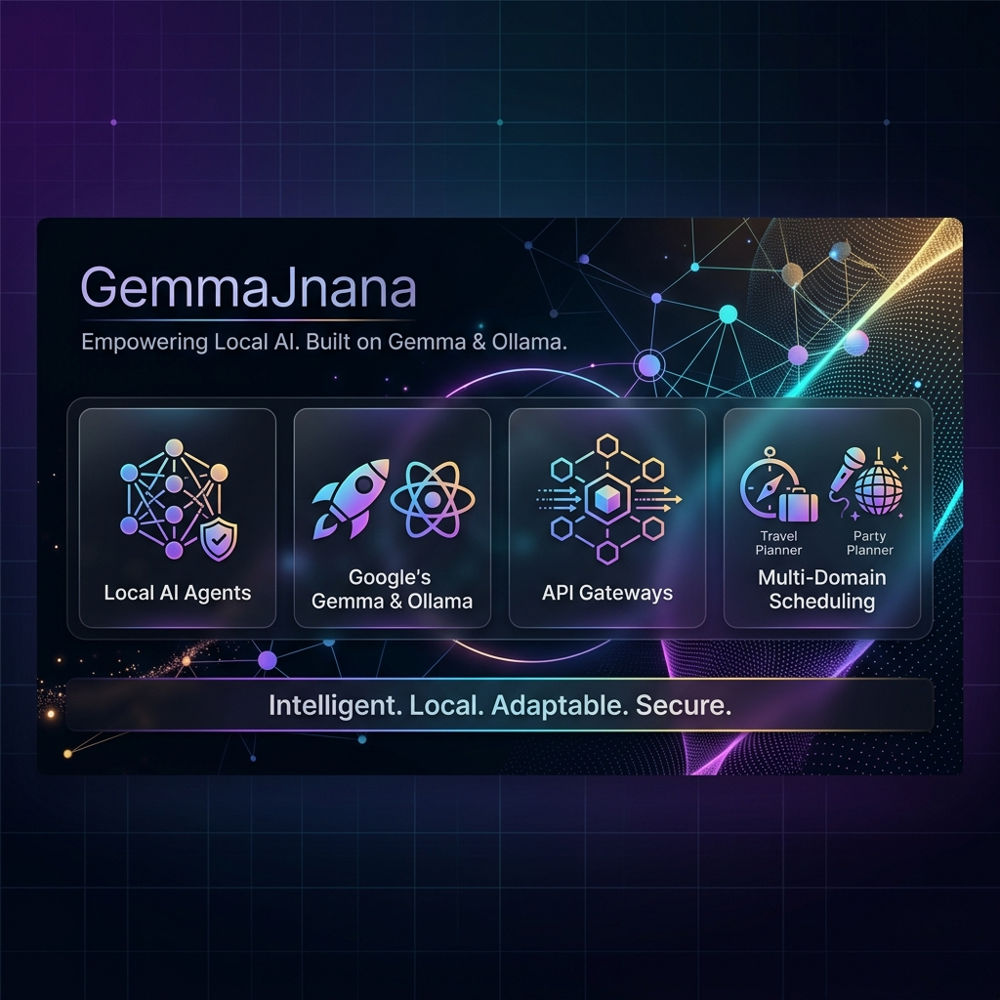
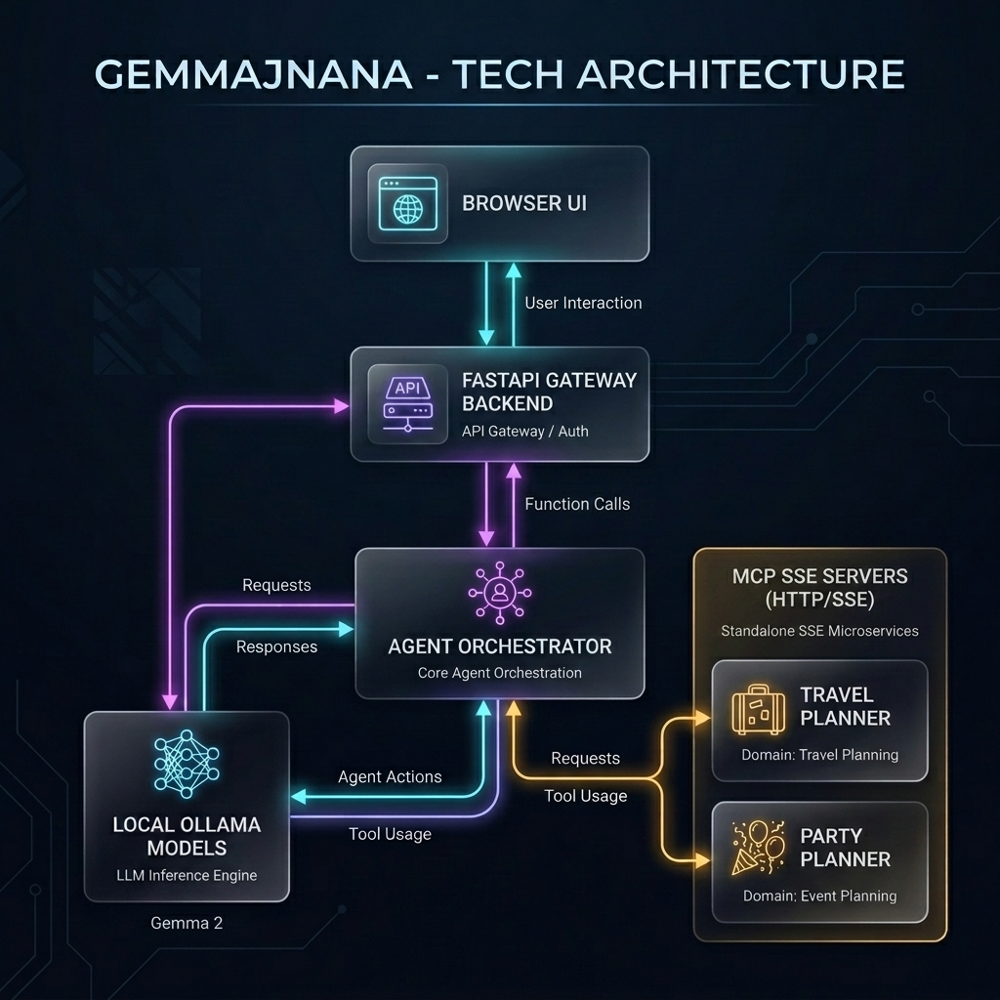
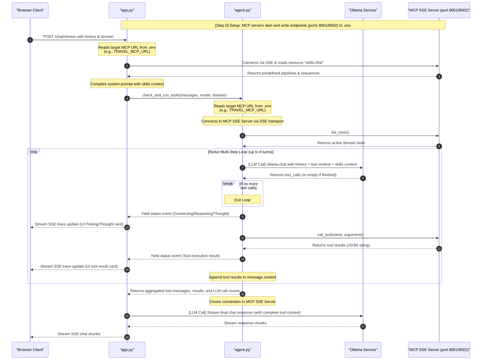
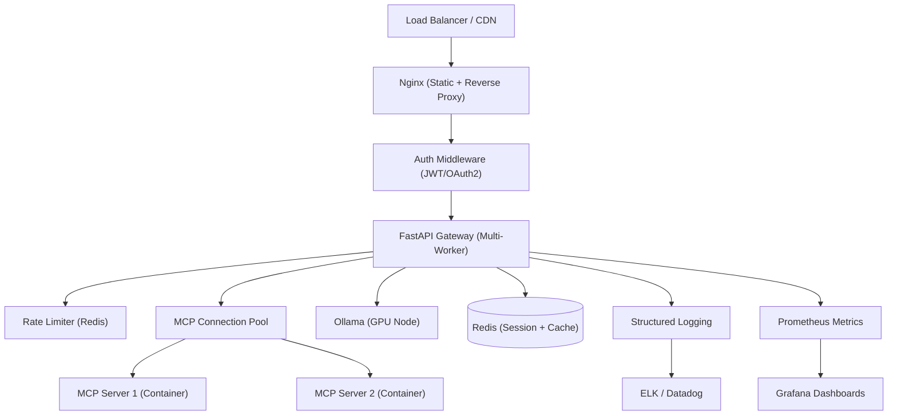
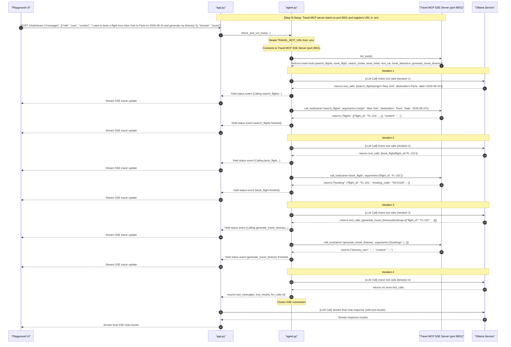
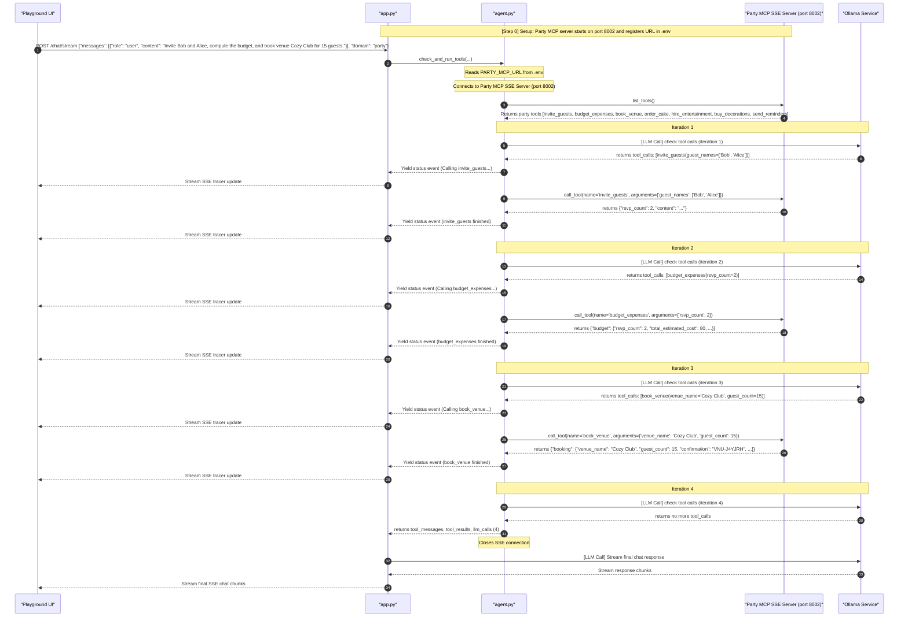

# GemmaJnana



A **production-pattern reference implementation** demonstrating how to build multi-domain AI agent orchestration using Google's **Gemma 2 (2B)** model, **Ollama**, the **Model Context Protocol (MCP)**, and an asynchronous **FastAPI** gateway. The package includes a networked MCP server architecture with dynamic skill discovery, a ReAct reasoning loop, and a fully animated chat playground UI.

> **Note:** This project demonstrates correct architectural patterns (MCP resources, ReAct loops, SSE streaming, multi-domain routing) with mock tool handlers. It is designed as an educational reference and portfolio showcase, not a production-deployed service. See [Enterprise Assessment](#enterprise-assessment) for what a full production deployment would require.

## Table of Contents
- [Project Architecture Flow](#project-architecture-flow)
  - [Data Flow Diagram](#data-flow-diagram)
  - [Dynamic Agentic Pipeline Flow](#dynamic-agentic-pipeline-flow)
- [Dynamic Routing Design Patterns](#dynamic-routing-design-patterns-automated-domain-switching)
  - [Pattern 1: Intent Classification (Two-Pass Routing)](#pattern-1-intent-classification-two-pass-routing)
  - [Pattern 2: Unified Multi-MCP Router (Single-Pass Agent)](#pattern-2-unified-multi-mcp-router-single-pass-agent---implemented-in-this-project)
- [Domain Architecture Overview](#domain-architecture-overview)
  - [Vacation Travel Planner](#1-vacation-travel-planner-mcp_serverstravel)
  - [Birthday Party Planner](#2-birthday-party-planner-mcp_serversparty)
- [Agent Capabilities & Limitations](#agent-capabilities--limitations)
- [File Structure](#file-structure)
- [Prerequisites](#prerequisites)
- [How to Run](#how-to-run)
- [Running Unit Tests](#running-unit-tests)
- [API Reference](#api-reference)
- [Enterprise Assessment](#enterprise-assessment)
  - [Production Readiness Summary](#summary)
  - [1. Connection Lifecycle](#1-connection-lifecycle--critical)
  - [2. Resilience](#2-resilience--critical)
  - [3. Security](#3-security--critical)
  - [4. Scalability](#4-scalability--critical)
  - [5. Observability](#5-observability--high)
  - [6. Deployment](#6-deployment--high)
  - [7. LLM Safety](#7-llm-safety--high)
  - [8. Production Architecture Target](#8-production-architecture-target)
- [Step-by-Step Code Execution Trace](#step-by-step-code-execution-trace-debugging-walkthrough)
  - [Scenario A: Vacation Flight Booking (Travel Domain)](#scenario-a-vacation-flight-booking-travel-domain)
  - [Scenario B: Party Setup & Venue Booking (Party Domain)](#scenario-b-party-setup--venue-booking-party-domain)

---

## Project Architecture Flow

Below is the visual flow of the GemmaJnana local multi-domain architecture.



### Data Flow Diagram


### Dynamic Agentic Pipeline Flow



---

## Dynamic Routing Design Patterns (Automated Domain Switching)

To automate domain and skill selection rather than forcing the user to manually select the domain via the UI dropdown, two primary design patterns can be used:

### Pattern 1: Intent Classification (Two-Pass Routing)
A lightweight classification pass is performed on the backend before the agent starts:
1. **Classifier Turn:** The backend intercepts the user's prompt and queries the LLM with a brief instructions:
   > *"Classify the user's query into one of these categories: 'travel' or 'party'. Respond only with the category name."*
2. **Targeted Connection:** Once the category is determined, the agent connects only to that specific MCP server (port `8001` or `8002`), loads that domain's instructions, and executes.
*   **Pros:** Keeps LLM context small and focused; minimizes token usage and potential model drift.
*   **Cons:** Requires a preliminary LLM reasoning pass, introducing a small latency before tool execution begins.

### Pattern 2: Unified Multi-MCP Router (Single-Pass Agent) - [Implemented in this project]
Exposes all tools and skills from both domains to the LLM simultaneously:
1. **Unified Client Session:** The client (`agent.py`) opens dual SSE connections to both the Travel and Party MCP servers at startup.
2. **Tool Aggregation:** The complete set of 14 tools is discovered, combined, and registered. When the LLM issues a tool call, the agent automatically routes it to the corresponding server session.
3. **Preloaded Skills:** Predefined JSON skills from both domains are merged into the system prompt, allowing the LLM to select and follow the correct pipeline dynamically based on the input text.
*   **Pros:** Single-pass execution (no classifier latency); allows the LLM to mix-and-match tools from both domains in the same session.
*   **Cons:** Increases the token size of the system prompt and tool pool.

---

## Domain Architecture Overview

GemmaJnana is structured as a multi-domain agentic framework supporting two fully featured planning assistant types. You can toggle between domains dynamically via the UI settings bar:

### 1. Vacation Travel Planner (`mcp_servers/travel/`)
Equips the agent with 7 tools to search flight/hotel inventory, make bookings, rent vehicles, schedule tourist attractions, and compile final formatted itinerary documents:
*   `search_flights(origin, destination, date)`
*   `book_flight(flight_id)`
*   `search_hotels(city, budget)`
*   `book_hotel(hotel_name, nights)`
*   `rent_car(city, car_type)`
*   `book_attraction(city, activity)`
*   `generate_travel_itinerary(bookings)`

#### Predefined Travel Skills (JSON pipelines under `skills/`):
*   **Full Vacation Planner Pipeline:** `search_flights` ➔ `book_flight` ➔ `search_hotels` ➔ `book_hotel` ➔ `generate_travel_itinerary`
*   **Quick Flight Booking Pipeline:** `search_flights` ➔ `book_flight` ➔ `generate_travel_itinerary`
*   **Accommodation & Ground Services Pipeline:** `search_hotels` ➔ `book_hotel` ➔ `rent_car` ➔ `book_attraction`

---

### 2. Birthday Party Planner (`mcp_servers/party/`)
Equips the AI assistant to manage invitations, budget estimations, venue scheduling, cake ordering, entertainment hiring, theme decorations, and reminders:
*   `invite_guests(guest_names)`
*   `budget_expenses(rsvp_count)`
*   `book_venue(venue_name, guest_count)`
*   `order_cake(flavor, size, inscription)`
*   `hire_entertainment(type)`
*   `buy_decorations(theme)`
*   `send_reminders(guest_emails, location)`

#### Predefined Party Skills (JSON pipelines under `skills/`):
*   **Core Event Planning Sequence:** `invite_guests` ➔ `budget_expenses` ➔ `book_venue` ➔ `order_cake` ➔ `send_reminders`
*   **Invitation & Budget Setup:** `invite_guests` ➔ `budget_expenses` ➔ `send_reminders`
*   **Logistics & Theme Purchasing:** `book_venue` ➔ `order_cake` ➔ `hire_entertainment` ➔ `buy_decorations`

---

## Agent Capabilities & Limitations

Before running the application, it is important to understand what this local agentic stack is capable of and its current boundaries:

| What the Agent CAN Do | What the Agent CANNOT Do |
| :--- | :--- |
| **Enforced Skill Sequences:** Strictly follows sequence pipelines defined in JSON (e.g. searching, booking, and itinerary generation in order). | **Real-world Bookings:** All bookings are mocked locally for testing safety. It does not spend real money or call live airline/hotel APIs. |
| **Dynamic Data Passing:** Feeds output states from previous steps into subsequent calls (e.g., passing RSVP counts to budget calculation). | **Real-Time Inventory Access:** The toolset operates on simulated local catalogs; it does not query actual live commercial availability. |
| **Interactive Domain Switching:** Automatically updates LLM instruction templates, loaded tools, and active skills when domain toggling. | **Dynamic Mid-Sequence Input:** Once a sequence starts, the agent executes it autonomously; it cannot pause to prompt you for decisions mid-flow. |
| **Comprehensive Logging:** Formats execution tracer cards in the UI and records detailed step-by-step telemetry in local logs. | **Extremely Complex Logic:** Running a 2B parameter model locally is excellent for sequence orchestration, but it may occasionally deviate on highly complex reasoning. |

---

## File Structure

```text
ollama-gemma-agents-mcp-skills/
├── mcp_servers/                 <-- Multi-domain MCP Servers
│   ├── travel/                  <-- Vacation Travel Planner Domain
│   │   ├── skills/              (JSON Skill pipelines)
│   │   ├── tools/               (Tool implementations & schemas)
│   │   └── mcp_server_travel.py (FastMCP Server process)
│   └── party/                   <-- Birthday Party Planner Domain
│       ├── skills/              (JSON Skill pipelines)
│       ├── tools/               (Tool implementations & schemas)
│       └── mcp_server_party.py  (FastMCP Server process)
├── tests/                       <-- Complete Unit Test Suite
│   ├── test_handlers.py         (Validates all 14 tool handlers)
│   ├── test_mcp.py              (Verifies tool registrations)
│   └── test_skills.py           (Validates JSON sequence formats)
├── agent.py                     (Asynchronous agent orchestrator & ReAct runner)
├── app.py                       (FastAPI Gateway & SSE event streams)
├── index.html                   (Beautiful dark-mode chat playground client)
├── logger.py                    (Global session logger)
├── start.sh                     (Automation installer & launcher)
└── stop.sh                      (Automation teardown script)
```

---

## Prerequisites

To run this application, make sure you have:
1.  **macOS** (the automated installer `start.sh` assumes Mac context).
2.  **Python 3.x** with dependencies listed in `requirements.txt`:
    ```bash
    pip install fastapi uvicorn ollama mcp fastmcp python-dotenv
    ```

---

## How to Run

1.  **Start the entire service stack**:
    ```bash
    ./start.sh
    ```
    This script automatically updates Ollama, pulls the `gemma2:2b` model, installs required dependencies, runs the backend API Gateway (port `8435`), and spins up a local web server (port `8080`).

2.  **Open the Web Playground**:
    Navigate to [**`http://localhost:8080`**](http://localhost:8080) in your browser. Toggle between **Vacation Travel Planner** and **Birthday Party Planner** domains dynamically using the selector in the upper right.

3.  **Shut down servers gracefully**:
    Press `Ctrl+C` in your terminal, or to guarantee all background processes (FastAPI, Ollama) exit cleanly, run:
    ```bash
    ./stop.sh
    ```

---

## Running Unit Tests

We maintain a rigorous test suite validating the registry, schemas, and execution responses of all tool handlers:
```bash
python3 -m unittest discover -s tests
```

---

## API Reference

The backend FastAPI gateway runs at `http://127.0.0.1:8435`:
*   `GET /health`: Diagnoses model presence and connection status.
*   `GET /tools?domain=...`: Lists active tools dynamically registered by FastMCP for the specified domain.
*   `GET /skills?domain=...`: Retrieves predefined JSON skill pipelines for the specified domain dynamically from the MCP server resource.
*   `POST /chat`: Simple non-streaming message response endpoint.
*   `POST /chat/stream`: Initiates an SSE text stream event channel, sending live tracer cards for active tools.

---

## Enterprise Assessment

This project implements correct architectural **patterns** for agentic AI orchestration. The following assessment maps each dimension of the current implementation against what a production-deployed enterprise service would require.

### Summary

| Area | Current State | Production Requirement | Gap Severity |
| :--- | :--- | :--- | :---: |
| **Connection Lifecycle** | Fresh SSE/TCP per request | Connection pooling with persistent sessions | 🔴 Critical |
| **Resilience** | No timeouts, retries, or circuit breakers | Timeouts on all external calls, retry with backoff | 🔴 Critical |
| **Security** | Open CORS, no auth, no rate limiting | JWT/OAuth2, RBAC, rate limiting, TLS, secrets vault | 🔴 Critical |
| **Scalability** | Single-process Uvicorn, `http.server` for UI | Multi-worker Gunicorn, Nginx, Redis for shared state | 🔴 Critical |
| **Observability** | Custom text logger to local files | Structured JSON logs, OpenTelemetry, Prometheus | 🟡 High |
| **Deployment** | Bash scripts (`start.sh` / `stop.sh`) | Docker Compose / Kubernetes, CI/CD, IaC | 🟡 High |
| **LLM Safety** | No input/output guardrails | Prompt injection protection, output filtering | 🟡 High |
| **API Maturity** | No versioning, no pagination | `/v1/` versioning, pagination, correlation IDs | 🟡 Medium |

---

### 1. Connection Lifecycle (🔴 Critical)

Every chat request opens fresh TCP + SSE + MCP connections, performs work, then tears them down:

```python
# agent.py — runs on EVERY request
async with AsyncExitStack() as stack:
    for name, url in urls:
        read, write = await stack.enter_async_context(sse_client(url))
        session = await stack.enter_async_context(ClientSession(read, write))
        await session.initialize()  # MCP handshake per request
```

**Impact:** 100 concurrent users = 100+ simultaneous TCP connections opening/closing. Each pays latency for TCP handshake + SSE setup + MCP `initialize()`. Under load, this exhausts file descriptors and causes cascading failures.

**Production pattern:** Connection pool with health-checked persistent sessions, or a sidecar that maintains long-lived MCP connections.

---

### 2. Resilience (🔴 Critical)

No defensive measures exist for external service failures:

```python
# No timeout — a hung MCP server blocks the worker forever
async with sse_client(mcp_url) as (read, write): ...

# No timeout — slow model inference locks the async worker
response = await client.chat(model=model_name, messages=..., tools=...)
```

| Missing | Impact |
| :--- | :--- |
| Request timeouts | Hung server blocks worker indefinitely |
| Circuit breaker | Down server gets hammered with connection attempts |
| Retry with backoff | Transient errors cause immediate failure |
| Graceful degradation | One failed MCP server can block all requests |

---

### 3. Security (🔴 Critical)

| Vulnerability | Current Code | Risk |
| :--- | :--- | :--- |
| Open CORS | `allow_origins=["*"]` in `app.py` | Any website can call the API |
| No authentication | No middleware | Anyone on network can invoke tools |
| No rate limiting | None | Single client can exhaust Ollama |
| Plaintext transport | HTTP only | Traffic visible on network |
| Secrets in `.env` | Plain text file | Exposed if host compromised |

---

### 4. Scalability (🔴 Critical)

**Frontend** — The UI is served by Python's built-in development server, which is single-threaded and blocking:
```bash
# start.sh — not suitable for production
python3 -m http.server 8080
```

**Backend** — Single Uvicorn process with no worker pool:
```python
# app.py — single worker, no crash recovery
uvicorn.run(app, host=host, port=port)
```

**State** — Session tracking is process-local and lost on restart:
```python
# logger.py — in-memory, not shareable across workers
session_files = {}
```

---

### 5. Observability (🟡 High)

| What Exists | What Enterprise Needs |
| :--- | :--- |
| Text logger to local files | Structured JSON logs → ELK / Datadog |
| No request correlation IDs | Distributed tracing (OpenTelemetry) |
| No metrics | Prometheus: latency, error rates, queue depth |
| Basic `/health` check | Liveness + readiness probes for all services |

---

### 6. Deployment (🟡 High)

| Current | Enterprise |
| :--- | :--- |
| `bash start.sh` | Docker Compose / Kubernetes manifests |
| `pkill -f` to stop processes | Container orchestration with restart policies |
| No environment separation | dev / staging / prod configurations |
| No CI/CD | Automated test → build → deploy pipeline |

---

### 7. LLM Safety (🟡 High)

| Gap | Risk |
| :--- | :--- |
| No prompt injection protection | Users can manipulate system behavior |
| No output guardrails | Model may return harmful content |
| No token budget management | Large histories can exceed context window |
| Hardcoded 8-iteration limit | Not configurable, no warning at limit |

---

### 8. Production Architecture Target

To deploy this as an enterprise service, the architecture would evolve to:



---

### What This Project Is

✅ A clean, well-tested **reference architecture** demonstrating correct MCP + agentic AI patterns
✅ An **educational implementation** of ReAct reasoning, SSE streaming, and multi-domain routing
✅ A **portfolio showcase** with production-grade patterns and mock tool handlers
✅ An excellent **starting point** for building a production-deployed service

The architectural patterns are sound — they need the operational infrastructure layer (connection pooling, auth, observability, containerization) to carry enterprise production load.

---

## Step-by-Step Code Execution Trace (Debugging Walkthrough)

To make it easy to follow the flow of control, here is a step-by-step trace showing exactly how inputs and outputs travel through the codebase for different scenarios.

---

### Scenario A: Vacation Flight Booking (Travel Domain)
**User Prompt:** `"I want to book a flight from New York to Paris on 2026-08-10 and generate my itinerary."`



#### **Step 0: Server Setup & Configuration (Pre-request Setup)**
Before any user request is made, the MCP servers must expose themselves to the gateway:
1. **Service Execution:** The Vacation Travel Planner and Birthday Party Planner MCP servers are launched as separate, standalone processes (listening on ports `8001` and `8002` respectively).
2. **Server Exposure:** The servers register their respective SSE connection endpoints within the shared `.env` file:
   - `TRAVEL_MCP_URL=http://127.0.0.1:8001/sse`
   - `PARTY_MCP_URL=http://127.0.0.1:8002/sse`
This acts as the local service registry that the agent reads at runtime to locate available servers.

#### **Step 1: Frontend Request**
The user selects the **Vacation Travel Planner** domain and enters the prompt. The browser client (`index.html`) issues an HTTP `POST` request to `/chat/stream` with the conversation history and active domain:
*   **Payload:**
    ```json
    {
      "messages": [
        {"role": "user", "content": "I want to book a flight from New York to Paris on 2026-08-10 and generate my itinerary."}
      ],
      "domain": "travel",
      "session_name": "default"
    }
    ```

#### **Step 2: Gateway Entry & Agent Call (`app.py` & `agent.py`)**
1. **Gateway Call:** The gateway endpoint `chat_stream` in `app.py` receives the payload and invokes `check_and_run_tools()`.
2. **Dynamic Server Discovery:** The agent does not hardcode server endpoints. Instead, it inspects the system environment variables loaded from the `.env` file, looking up the key matching `{domain.upper()}_MCP_URL` (e.g. `TRAVEL_MCP_URL`). If `domain="all"` or `domain="unified"`, it dynamically iterates all keys ending in `_MCP_URL`.
3. **Transport Handshake:** The agent connects to the resolved SSE URL (e.g., `http://127.0.0.1:8001/sse`) using the Server-Sent Events standard transport (`sse_client`), initializes an MCP `ClientSession`, and performs the initial protocol handshake.
4. **Dynamic Tool Registration:** The agent invokes `list_tools()` over the network session. The MCP server returns its supported tool schemas. The agent registers them dynamically in a local `tool_to_session` router map to handle subsequent LLM tool calls.

#### **Step 3: ReAct Reasoning Loop & Execution Trace (`agent.py`)**
1. **Turn 1 (Search):** The agent queries Ollama. Ollama identifies that the user wants to book a flight but needs flight options first, returning a request to call `search_flights(origin='New York', destination='Paris', date='2026-08-10')`. The agent executes the tool over HTTP/SSE, which returns a list of flight choices (including `FL-101`).
2. **Turn 2 (Booking):** The agent queries Ollama with the flight options. Ollama selects flight `FL-101` and requests `book_flight(flight_id='FL-101')`. The agent executes this tool and receives a confirmation code.
3. **Turn 3 (Itinerary):** The agent queries Ollama with the booking confirmation. Ollama realizes all steps for the requested pipeline are complete and requests `generate_travel_itinerary(bookings=[...])`. The agent runs the compiler to produce a structured document.
4. **Turn 4 (Finished):** The agent queries Ollama one final time, which returns no further tool calls.

#### **Step 4: Cleanup & Final Inference (`app.py`)**
1. The agent closes the active network connection to the travel MCP SSE server.
2. The gateway appends the tool messages history to the conversation list and requests the final streaming inference from Ollama.
3. Ollama generates a friendly conversational summary containing the travel itinerary details, which streams directly to the frontend.

---

### Scenario B: Party Setup & Venue Booking (Party Domain)
**User Prompt:** `"Invite Bob and Alice, compute the budget, and book venue Cozy Club for 15 guests."`



#### **Step 0: Server Setup & Configuration (Pre-request Setup)**
Before any user request is made, the MCP servers must expose themselves to the gateway:
1. **Service Execution:** The Vacation Travel Planner and Birthday Party Planner MCP servers are launched as separate, standalone processes (listening on ports `8001` and `8002` respectively).
2. **Server Exposure:** The servers register their respective SSE connection endpoints within the shared `.env` file:
   - `TRAVEL_MCP_URL=http://127.0.0.1:8001/sse`
   - `PARTY_MCP_URL=http://127.0.0.1:8002/sse`
This acts as the local service registry that the agent reads at runtime to locate available servers.

#### **Step 1: Frontend Request**
The user selects the **Birthday Party Planner** domain and enters the prompt. The browser client (`index.html`) issues an HTTP `POST` request to `/chat/stream` with the conversation history and active domain:
*   **Payload:**
    ```json
    {
      "messages": [
        {"role": "user", "content": "Invite Bob and Alice, compute the budget, and book venue Cozy Club for 15 guests."}
      ],
      "domain": "party",
      "session_name": "default"
    }
    ```

#### **Step 2: Gateway Entry & Agent Call (`app.py` & `agent.py`)**
1. **Gateway Call:** The gateway endpoint `chat_stream` in `app.py` receives the payload and invokes `check_and_run_tools()`.
2. **Dynamic Server Discovery:** The agent does not hardcode server endpoints. Instead, it inspects the system environment variables loaded from the `.env` file, looking up the key matching `{domain.upper()}_MCP_URL` (e.g. `PARTY_MCP_URL`). If `domain="all"` or `domain="unified"`, it dynamically iterates all keys ending in `_MCP_URL`.
3. **Transport Handshake:** The agent connects to the resolved SSE URL (e.g., `http://127.0.0.1:8002/sse`) using the Server-Sent Events standard transport (`sse_client`), initializes an MCP `ClientSession`, and performs the initial protocol handshake.
4. **Dynamic Tool Registration:** The agent invokes `list_tools()` over the network session. The MCP server returns its supported tool schemas (such as `invite_guests`, `budget_expenses`, `book_venue`). The agent registers them dynamically in a local `tool_to_session` router map to handle subsequent LLM tool calls.

#### **Step 3: ReAct Reasoning Loop & Execution Trace (`agent.py`)**
1. **Turn 1 (Invite Guests):** The agent queries Ollama. Ollama identifies that the user wants to invite Bob and Alice, requesting a call to `invite_guests(guest_names=['Bob', 'Alice'])`. The agent executes the tool over HTTP/SSE, which returns an RSVP count of 2.
2. **Turn 2 (Compute Budget):** The agent queries Ollama with the RSVP update. Ollama selects the `budget_expenses(rsvp_count=2)` tool. The agent executes this tool and receives a budget cost calculation of $80.
3. **Turn 3 (Book Venue):** The agent queries Ollama with the budget details. Ollama notices that the user also requested booking the venue "Cozy Club" for 15 guests, and invokes `book_venue(venue_name='Cozy Club', guest_count=15)`. The agent runs this tool and receives the reservation confirmation code (`VNU-J4YJRH`).
4. **Turn 4 (Finished):** The agent queries Ollama one final time, which returns no further tool calls.

#### **Step 4: Cleanup & Final Inference (`app.py`)**
1. The agent closes the active network connection to the party MCP SSE server.
2. The gateway appends the tool messages history to the conversation list and requests the final streaming inference from Ollama.
3. Ollama generates a friendly conversational summary containing the invitation stats, budget estimate, and venue booking details, which streams directly to the frontend.

#### **Step-by-Step Execution Log Trace (As-Is from Logger)**

```diff
  [app.py:event_generator:147] Received chat stream request for domain 'party'. Temperature=0.3
  [app.py:event_generator:157] Message history loaded with system prompt for domain 'party'. Total messages: 2
+ [agent.py:check_and_run_tools:158] Connecting to 1 active MCP server(s)...
+ [agent.py:check_and_run_tools:175] Initializing dynamic MCP tool discovery...
  [agent.py:check_and_run_tools:213] Discovered 7 tool(s) from MCP server: ['invite_guests', 'budget_expenses', 'book_venue', 'order_cake', 'hire_entertainment', 'buy_decorations', 'send_reminders']
+ [agent.py:check_and_run_tools:217] [LLM Call] Checking if the model requests any tool calls (iteration 1)...
  [agent.py:check_and_run_tools:277] Model requested 1 tool call(s) at iteration 1: ['invite_guests']
  [agent.py:check_and_run_tools:300] Executing tool 'invite_guests' via MCP with args: {'guest_names': ['Bob', 'Alice']}
  [invite_guests.py:handler:25] Sending party invitations to 2 guests...
  [invite_guests.py:handler:32] RSVP count received: 2/2
  [agent.py:check_and_run_tools:374] Tool 'invite_guests' execution completed successfully.
+ [agent.py:check_and_run_tools:217] [LLM Call] Checking if the model requests any tool calls (iteration 2)...
  [agent.py:check_and_run_tools:277] Model requested 1 tool call(s) at iteration 2: ['budget_expenses']
  [agent.py:check_and_run_tools:300] Executing tool 'budget_expenses' via MCP with args: {'rsvp_count': 2}
  [budget_expenses.py:handler:23] Estimating costs for 2 guests...
  [budget_expenses.py:handler:42] Total estimated budget: $80
  [agent.py:check_and_run_tools:374] Tool 'budget_expenses' execution completed successfully.
+ [agent.py:check_and_run_tools:217] [LLM Call] Checking if the model requests any tool calls (iteration 3)...
  [agent.py:check_and_run_tools:277] Model requested 1 tool call(s) at iteration 3: ['book_venue']
  [agent.py:check_and_run_tools:300] Executing tool 'book_venue' via MCP with args: {'venue_name': 'Cozy Club', 'guest_count': 15}
  [book_venue.py:handler:28] Reserving venue 'Cozy Club' for 15 guests...
  [book_venue.py:handler:41] Venue booked successfully. Confirmation: VNU-J4YJRH
  [agent.py:check_and_run_tools:374] Tool 'book_venue' execution completed successfully.
+ [agent.py:check_and_run_tools:217] [LLM Call] Checking if the model requests any tool calls (iteration 4)...
  [agent.py:check_and_run_tools:267] No more tool calls requested by the model at iteration 4.
  [app.py:event_generator:174] Extending history with 6 tool message(s).
+ [app.py:event_generator:177] [LLM Call] Calling Ollama chat stream...
  [app.py:event_generator:193] Stream completed successfully. Sent 288 chunk(s).
  [app.py:event_generator:196] Session Summary: Total LLM Calls: 5 | Executed Tool Calls: ['invite_guests', 'budget_expenses', 'book_venue']
```
